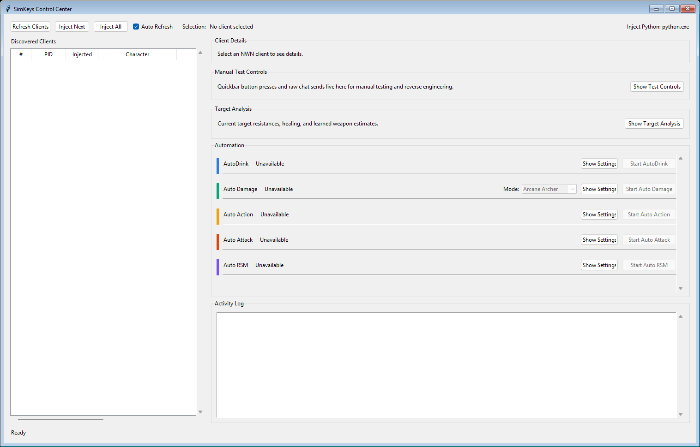

# SimKeys for NWN Higher Ground

SimKeys is a Windows control toolkit for **Neverwinter Nights** clients running on the **Higher Ground** server. It was written by **Starcore** to drive in-game functionality without window focus, using direct in-process hooks and a named-pipe control layer instead of foreground key sending.

This public repository contains the SimKeys source, a bundled hook DLL, build files, notes, and packaged `characters.d` support data. It intentionally does not include a game install or unrelated third-party client/script folders.



## What it does

- Discovers running `nwmain.exe` clients and injects the next uninjected client.
- Exposes a per-client named pipe for quickbar, chat, state, and automation control.
- Triggers quickbar slots directly through game functions, including Base, Shift, and Control quickbar banks.
- Sends chat through an unfocused client path.
- Provides a desktop GUI for multi-client script control.
- Includes automations for AutoDrink, Stop Hitting, Auto Damage, Auto Attack, Auto Follow, Auto Action, and Auto RSM.

## Requirements

- Windows
- Neverwinter Nights Diamond / `nwmain.exe`
- Python for the GUI, controller scripts, and injection. 64-bit Python can inject the 32-bit NWN client.
- Visual Studio 2022 Build Tools with the C++ workload, only if rebuilding the hook DLL yourself

## Repository Layout

- `simkeys_gui.ps1`
  - Main GUI launcher.
- `simkeys_control.ps1`
  - CLI launcher for listing, injecting, querying, slot triggering, and chat send.
- `bin/SimKeysHook2.dll`
  - Bundled prebuilt hook DLL used by default.
- `src/simkeys_app/`
  - Python GUI, controller, pipe client, runtime helpers, and automation host.
- `src/native/SimKeysHook2/`
  - Visual Studio native hook source, solution, and build wrapper.
- `data/characters.d/`
  - Packaged `characters.d` XML data used by Auto Damage scoring.
- `docs/reverse-engineering/notes/`
  - SimKeys-specific reverse-engineering notes.

## Run the GUI

From the repository root:

```powershell
powershell -NoProfile -ExecutionPolicy Bypass -File .\simkeys_gui.ps1
```

If you want to supply an alternate Python path for injection:

```powershell
powershell -NoProfile -ExecutionPolicy Bypass -File .\simkeys_gui.ps1 -InjectPython "C:\Users\you\AppData\Local\Programs\Python\Python313\python.exe"
```

## Run the CLI Controller

List clients:

```powershell
powershell -NoProfile -ExecutionPolicy Bypass -File .\simkeys_control.ps1 list
```

Inject the next uninjected client:

```powershell
powershell -NoProfile -ExecutionPolicy Bypass -File .\simkeys_control.ps1 inject-next
```

Inject all discovered clients:

```powershell
powershell -NoProfile -ExecutionPolicy Bypass -File .\simkeys_control.ps1 inject-all
```

Query one injected client:

```powershell
powershell -NoProfile -ExecutionPolicy Bypass -File .\simkeys_control.ps1 query 1
```

Trigger a quickbar slot:

```powershell
powershell -NoProfile -ExecutionPolicy Bypass -File .\simkeys_control.ps1 slot 1 1
```

Send chat through a client:

```powershell
powershell -NoProfile -ExecutionPolicy Bypass -File .\simkeys_control.ps1 chat-send 1 "!action rsm self"
```

## Bundled DLL

The repository includes `bin\SimKeysHook2.dll`, so users do not need Visual Studio just to run SimKeys. The GUI and CLI prefer this bundled DLL automatically.

Runtime logs are written under `logs\` in the repository root. They are ignored by git.

## Rebuild the DLL

If you want to rebuild the hook from source, install Visual Studio 2022 Build Tools with the C++ workload, then run:

```powershell
powershell -NoProfile -ExecutionPolicy Bypass -File .\src\native\SimKeysHook2\build.ps1
```

The build wrapper rebuilds the x86 Release DLL and copies it into `bin\SimKeysHook2.dll`, replacing the bundled copy.

## Data

The repository includes `data\characters.d\` so Auto Damage works out of the box with the packaged dataset.

## Automation Notes

The GUI script panel runs these automations per injected client. Chat-driven scripts only process new lines by default; enable `Backlog` if you intentionally want a script to inspect older buffered combat lines when it starts.

- **AutoDrink**
  - Watches combat activity involving the client, reads the character HP directly from NWN memory, and fires a configured quickbar slot when HP falls at or below the configured percentage.
  - The potion slot can be on the Base, Shift, or Control quickbar bank. By default it uses slot 2, locks the current opponent before drinking, waits for the drink cooldown, then resumes with `!action attack locked`.
  - Useful for general survival automation where you still want the client to keep fighting after the drink completes. If `Resume` is disabled, the script drinks but does not restart attacks.
  - Logs the HP snapshot, threshold, quickbar trigger, and remote trigger result; optional console echo prints a compact in-game status line.

- **Stop Hitting**
  - Watches your outgoing damage lines and checks the defender against the packaged `characters.d` data.
  - If the target is marked `kickback="Area"`, it immediately triggers the configured healing potion slot and enters a short interrupt cooldown so repeated damage lines do not spam potions.
  - Unlike AutoDrink, Stop Hitting intentionally does not resume attacking after the potion. The drink acts as an interrupt so you stop feeding area kickback or similar punishment mechanics.
  - Requires the injected client identity to be known so it can distinguish your damage from party, summon, or environmental damage lines.

- **Auto Damage**
  - Watches your attack and damage log lines, identifies the current target, and uses `characters.d` immunity, resistance, healing, and paragon data to choose the safest/highest expected damage option without needing game focus.
  - `Arcane Archer` mode selects the best `!dam*` type for AA-style damage. `Zen Ranger` mode accounts for linked elemental/exotic damage pairs. `Divine Slinger` mode selects elemental/divine damage and can also sequence breach (`!dambr`) or blind (`!dambd`) for known targets that need those effects.
  - `Gnomish Inventor` mode selects the best `!gi bolt` type, resets to zappers before non-zapper bolt changes when needed, and can keep a canister loop running for the current target. Small fetch-style targets use `!gi canister 4`; other targets use `!gi canister 2`.
  - `Weapon Swap` mode learns configured weapon quickbar slots from observed damage components, matches those learned profiles against target defenses, avoids weapons that would heal the target, and swaps to the best safe weapon. The target analysis panel shows learned weapon profiles, expected damage, healing warnings, and the recommended slot.
  - The `Dice`, poll, batch, echo, backlog, and weapon-swap cooldown settings tune how quickly it reacts and how much detail it reports.

- **Auto Action**
  - Runs a simple cooldown loop that repeatedly sends one selected HG action command through the injected chat path.
  - Supported modes are Called Shot (`!action cs opponent`), Knockdown (`!action kd opponent`), and Disarm (`!action dis opponent`).
  - It does not need the chat-feed parser; it just sends the selected command every configured cooldown and reports send failures until the command path recovers.

- **Auto Attack**
  - Runs a cooldown loop that repeatedly sends `!action attack lead:opponent`.
  - Before enabling it, set the lead role in game with `!role lead`; the repeated command expects that role to exist so `lead:opponent` resolves to the right target.
  - This matches the old HGXLE `autoAttack.py` behavior and is useful for keeping an unfocused client attacking the lead opponent without foreground key presses.
  - It does not parse combat chat; the only runtime setting is the repeat cooldown.

- **Auto Follow**
  - Listens for another player saying a follow cue such as `fall in`, `follow me`, or `follow my`.
  - When a cue is seen, it sends `!action aso target` and then `/tell "<speaker>" !target`, matching the old HGXLE `autoFollow.py` behavior.
  - It ignores cues from the current character, uses a short cooldown to avoid duplicate rapid triggers, and can optionally echo successful follow actions to the in-game console.
  - This is useful for box/follower clients that should automatically target and follow the caller when the leader asks the group to fall in.

- **Auto RSM**
  - Watches your attack lines, reads the client RSM status byte from NWN memory, and sends `!action rsm self` when you attack while RSM is not active.
  - Uses a configurable cooldown after each trigger so it does not spam the command. If the memory probe fails, it reports the probe error and waits for recovery rather than blindly sending RSM.
  - Optional console echo can print the trigger result in game, but it is off by default to keep combat chat quieter.

## License

SimKeys is released under the MIT License. See `LICENSE`.

## Notes

- This project is intended for use on the **Neverwinter Nights Higher Ground** server.
- Written by **Starcore**.
- If you build new scripts, automations, reverse-engineering findings, or quality-of-life features on top of SimKeys, please consider sharing them openly so the Higher Ground community can improve the toolset together.
- This is an unofficial project and is not affiliated with BioWare, Beamdog, or the Higher Ground server team.
